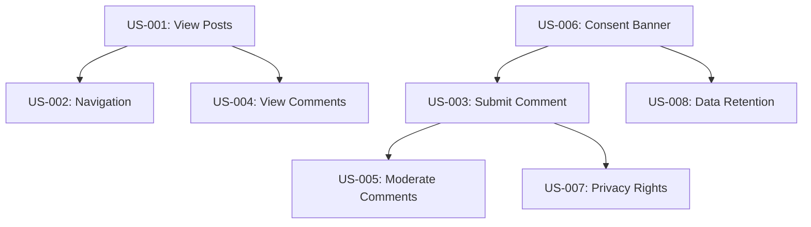

# GoNoGo Blog - User Stories

**Project**: GoNoGo Blog
**Version**: 1.0
**Last Updated**: [Date]
**Product Owner**: [Name]

## Epic Overview

### Epic 1: Blog Content Management
Core blog functionality for reading and publishing content.

### Epic 2: Comment System with GDPR Compliance
User comments with full GDPR compliance and consent management.

### Epic 3: Privacy and Consent Management
GDPR-compliant privacy controls and user rights management.

---

## Epic 1: Blog Content Management

### US-001: View Blog Posts
**As a** blog visitor
**I want** to read blog posts on the website
**So that** I can access valuable content without barriers

#### Business Value
- Provides core value proposition of the blog
- Drives traffic and engagement
- No privacy implications (public content)

#### Acceptance Criteria
##### Functional Requirements
- [ ] **Given** I visit the blog homepage, **When** I look at the page, **Then** I see a list of published blog posts
- [ ] **Given** I click on a blog post title, **When** the page loads, **Then** I can read the full blog post content
- [ ] **Given** I am reading a blog post, **When** I scroll through it, **Then** the content is properly formatted and readable

##### Non-Functional Requirements
- [ ] **Performance**: Page loads in under 2 seconds
- [ ] **SEO**: Posts are properly indexed by search engines
- [ ] **Accessibility**: Content meets WCAG 2.1 AA standards
- [ ] **GDPR Compliance**: No personal data collected for reading

#### GDPR Considerations
##### Data Processing
- **Personal Data Involved**: No
- **Legal Basis**: N/A (no personal data)
- **Retention Period**: N/A
- **Data Subject Rights**: N/A

**Story Points**: 3
**Priority**: High
**Status**: Backlog

---

### US-002: Blog Post Navigation
**As a** blog visitor
**I want** to navigate between blog posts easily
**So that** I can discover and read more content

#### Business Value
- Increases page views and session duration
- Improves user experience
- Supports content discovery

#### Acceptance Criteria
##### Functional Requirements
- [ ] **Given** I am reading a blog post, **When** I look for navigation options, **Then** I see links to previous/next posts
- [ ] **Given** I want to browse by category, **When** I use category filters, **Then** I see posts filtered by category
- [ ] **Given** I want to find specific content, **When** I use the search function, **Then** I get relevant results

##### Non-Functional Requirements
- [ ] **Performance**: Navigation responds instantly
- [ ] **SEO**: Proper internal linking structure
- [ ] **GDPR Compliance**: No tracking without consent

#### GDPR Considerations
##### Data Processing
- **Personal Data Involved**: No (unless search analytics enabled with consent)
- **Legal Basis**: N/A or Consent for analytics
- **Retention Period**: N/A or per consent policy
- **Data Subject Rights**: N/A or standard rights

**Story Points**: 5
**Priority**: Medium
**Status**: Backlog

---

## Epic 2: Comment System with GDPR Compliance

### US-003: Submit Comment with Consent
**As a** blog reader
**I want** to leave a comment on a blog post
**So that** I can engage with the content and author

#### Business Value
- Increases user engagement and community building
- Provides feedback mechanism for content
- Critical for blog success but must be GDPR compliant

#### Acceptance Criteria
##### Functional Requirements
- [ ] **Given** I am reading a blog post, **When** I scroll to the comment section, **Then** I see a comment form
- [ ] **Given** I want to comment, **When** I fill in my name and comment, **Then** I can submit without providing email
- [ ] **Given** I want reply notifications, **When** I check the email notification box, **Then** I must provide email and consent
- [ ] **Given** I submit a comment, **When** processing completes, **Then** my comment appears after moderation

##### Non-Functional Requirements
- [ ] **Security**: All inputs are validated and sanitized
- [ ] **Performance**: Comment submission completes within 3 seconds
- [ ] **GDPR Compliance**: Clear consent for any email collection

#### GDPR Considerations
##### Data Processing
- **Personal Data Involved**: Yes - name (required), email (optional)
- **Legal Basis**: Consent (Article 6(1)(a))
- **Retention Period**: 3 years or until withdrawal
- **Data Subject Rights**: All rights apply (access, rectification, erasure, etc.)

##### Consent Management
- [ ] Consent collection mechanism for email notifications
- [ ] Clear explanation of data use
- [ ] Easy consent withdrawal process
- [ ] Purpose limitation respected (only for notifications)

**Story Points**: 8
**Priority**: High
**Status**: Backlog

---

### US-004: View Comments
**As a** blog reader
**I want** to see comments from other readers
**So that** I can read different perspectives and join the discussion

#### Business Value
- Enhances content value through community discussion
- Increases time on page
- Builds community around content

#### Acceptance Criteria
##### Functional Requirements
- [ ] **Given** I am reading a blog post, **When** I scroll to comments section, **Then** I see approved comments
- [ ] **Given** there are many comments, **When** I view the section, **Then** comments are paginated or have load more
- [ ] **Given** I read a comment, **When** I view it, **Then** I see commenter name and comment date

##### Non-Functional Requirements
- [ ] **Performance**: Comments load quickly
- [ ] **Security**: No XSS vulnerabilities in comment display
- [ ] **GDPR Compliance**: Only display data with valid consent

#### GDPR Considerations
##### Data Processing
- **Personal Data Involved**: Yes - displaying consented names
- **Legal Basis**: Consent for display
- **Retention Period**: As per consent agreement
- **Data Subject Rights**: Right to rectification and erasure apply

**Story Points**: 3
**Priority**: High
**Status**: Backlog

---

### US-005: Moderate Comments
**As a** blog administrator
**I want** to moderate comments before they are published
**So that** I can maintain content quality and prevent spam/abuse

#### Business Value
- Maintains content quality and brand reputation
- Prevents spam and abusive content
- Legal protection from harmful content

#### Acceptance Criteria
##### Functional Requirements
- [ ] **Given** a new comment is submitted, **When** it enters the system, **Then** it requires approval before display
- [ ] **Given** I am reviewing comments, **When** I access the admin panel, **Then** I see pending comments
- [ ] **Given** I review a comment, **When** I make a decision, **Then** I can approve, reject, or request modification

##### Non-Functional Requirements
- [ ] **Security**: Admin panel requires authentication
- [ ] **Performance**: Moderation interface is responsive
- [ ] **GDPR Compliance**: Respect data subject rights during moderation

#### GDPR Considerations
##### Data Processing
- **Personal Data Involved**: Yes - admin processes personal data
- **Legal Basis**: Legitimate interest for content moderation
- **Retention Period**: As per content policy
- **Data Subject Rights**: All rights respected during moderation

**Story Points**: 5
**Priority**: Medium
**Status**: Backlog

---

## Epic 3: Privacy and Consent Management

### US-006: GDPR Consent Banner
**As a** website visitor
**I want** to understand and control how my data is used
**So that** I can make informed decisions about my privacy

#### Business Value
- Legal compliance with GDPR and French CNIL requirements
- Builds user trust through transparency
- Avoids legal penalties

#### Acceptance Criteria
##### Functional Requirements
- [ ] **Given** I visit the website for the first time, **When** the page loads, **Then** I see a consent banner
- [ ] **Given** I see the consent banner, **When** I review options, **Then** I can accept all, reject all, or customize
- [ ] **Given** I want to customize, **When** I click customize, **Then** I see specific consent categories
- [ ] **Given** I make consent choices, **When** I confirm, **Then** my preferences are saved and respected

##### Non-Functional Requirements
- [ ] **Legal**: Complies with GDPR Article 7 and French CNIL guidelines
- [ ] **UX**: Non-intrusive but clearly visible
- [ ] **Performance**: Doesn't slow page load

#### GDPR Considerations
##### Data Processing
- **Personal Data Involved**: Consent preferences (pseudonymized)
- **Legal Basis**: Necessary for compliance
- **Retention Period**: 1 year or until withdrawal
- **Data Subject Rights**: Access and withdrawal at any time

##### Consent Management
- [ ] Granular consent options
- [ ] Clear consent withdrawal mechanism
- [ ] Consent versioning for policy changes
- [ ] Consent proof storage

**Story Points**: 8
**Priority**: Critical
**Status**: Backlog

---

### US-007: Privacy Rights Management
**As a** website user
**I want** to exercise my GDPR privacy rights
**So that** I can control my personal data

#### Business Value
- Legal compliance with GDPR Articles 15-22
- Demonstrates commitment to privacy
- Builds user trust and confidence

#### Acceptance Criteria
##### Functional Requirements
- [ ] **Given** I want to see my data, **When** I request data access, **Then** I receive a complete data export
- [ ] **Given** I want to correct my data, **When** I request rectification, **Then** I can update incorrect information
- [ ] **Given** I want to delete my data, **When** I request erasure, **Then** all my personal data is removed
- [ ] **Given** I want to export my data, **When** I request portability, **Then** I get data in structured format

##### Non-Functional Requirements
- [ ] **Legal**: 30-day response time maximum
- [ ] **Security**: Identity verification required
- [ ] **Audit**: All requests logged for compliance

#### GDPR Considerations
##### Data Processing
- **Personal Data Involved**: All personal data in system
- **Legal Basis**: Legal obligation (GDPR compliance)
- **Retention Period**: Request logs kept for audit (3 years)
- **Data Subject Rights**: This IS the implementation of rights

##### Rights Implementation
- [ ] Right of access (Article 15)
- [ ] Right of rectification (Article 16)
- [ ] Right to erasure (Article 17)
- [ ] Right to data portability (Article 20)

**Story Points**: 13
**Priority**: High
**Status**: Backlog

---

### US-008: Data Retention Management
**As a** data protection officer
**I want** personal data to be automatically removed after retention periods
**So that** we comply with GDPR data minimization principles

#### Business Value
- Automatic GDPR compliance for data retention
- Reduces privacy risk exposure
- Demonstrates privacy by design

#### Acceptance Criteria
##### Functional Requirements
- [ ] **Given** comment data is 3 years old, **When** retention job runs, **Then** personal data is anonymized
- [ ] **Given** consent is withdrawn, **When** processing, **Then** associated data is removed within 30 days
- [ ] **Given** IP addresses are 30 days old, **When** cleanup runs, **Then** IPs are anonymized
- [ ] **Given** data retention occurs, **When** completed, **Then** audit logs are created

##### Non-Functional Requirements
- [ ] **Automation**: Runs automatically without manual intervention
- [ ] **Reliability**: 99.9% successful execution rate
- [ ] **Audit**: Complete audit trail of all retention actions

#### GDPR Considerations
##### Data Processing
- **Personal Data Involved**: All personal data subject to retention
- **Legal Basis**: Legal obligation (GDPR compliance)
- **Retention Period**: Varies by data type
- **Data Subject Rights**: Supports right to erasure

**Story Points**: 8
**Priority**: High
**Status**: Backlog

---

## Story Dependencies

## Release Planning

### MVP Release (v1.0)
- US-001: View Blog Posts
- US-006: GDPR Consent Banner
- US-003: Submit Comment with Consent
- US-004: View Comments

### Release 1.1
- US-002: Blog Post Navigation
- US-005: Moderate Comments
- US-007: Privacy Rights Management

### Release 1.2
- US-008: Data Retention Management
- Performance optimizations
- Advanced privacy features

---

**Total Story Points**: 53
**Estimated Velocity**: 8-10 points per iteration
**Estimated Timeline**: 6-7 iterations for MVP