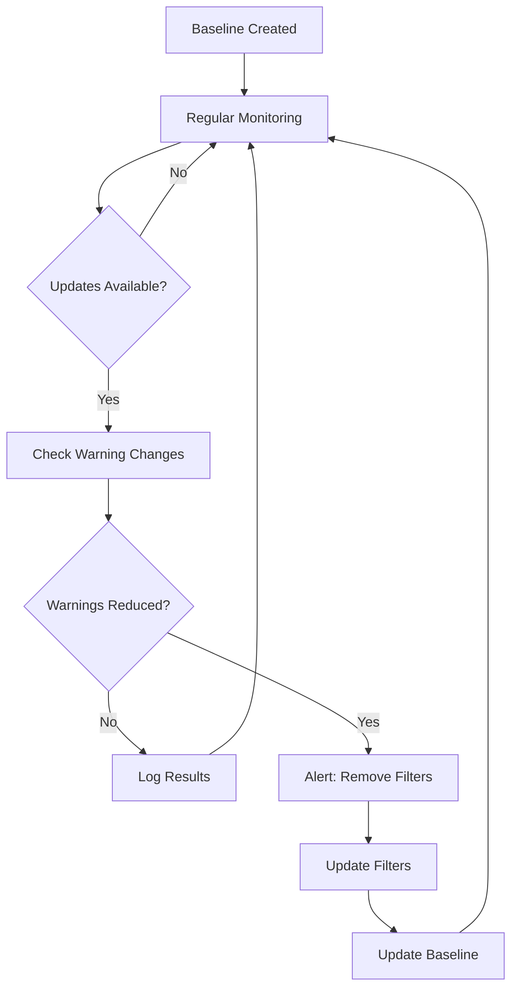

# External Dependency Warning Monitoring Guide

**Purpose:** Track external dependency warnings over time to detect when dependencies fix their deprecation warnings, allowing us to remove our warning filters safely.

## Quick Start

### 1. Initial Setup (One-time)
```bash
# Create baseline of current external warnings
python tools/monitor_external_warnings.py --baseline
```

### 2. Regular Monitoring (Weekly/Monthly)
```bash
# Check for warning changes and generate report if changes found
python tools/monitor_external_warnings.py --report

# Check for dependency updates and auto-monitor warnings
python tools/check_dependency_updates.py --auto-monitor
```

### 3. After Dependency Updates
```bash
# Check if warnings changed after updating dependencies
python tools/monitor_external_warnings.py --check

# Update baseline if changes are confirmed stable
python tools/monitor_external_warnings.py --update-baseline
```

## Problem Being Solved

**Issue:** We filter external dependency warnings (like SQLAlchemy datetime deprecations) to keep our logs clean, but we need to know when these dependencies fix their warnings so we can remove our filters.

**Solution:** Automated monitoring that tracks warning patterns over time and alerts when external dependencies resolve their deprecation warnings.

## How It Works

### Current External Dependencies Monitored

1. **SQLAlchemy (v2.0.43)**
   - **Warning Pattern:** `datetime.datetime.utcnow() is deprecated`
   - **Current Status:** 0 warnings detected (our baseline)
   - **Filter Location:** `pyproject.toml` filterwarnings section

2. **pytest-asyncio (v1.2.0)**
   - **Warning Pattern:** `asyncio_default_fixture_loop_scope`
   - **Current Status:** 0 warnings detected (our baseline)
   - **Filter Location:** `tests/conftest.py` dynamic filtering

### Monitoring Workflow



## Tools Overview

### 1. External Warning Monitor (`tools/monitor_external_warnings.py`)

**Purpose:** Track warning patterns for specific external dependencies

**Commands:**
```bash
# Create/update baseline
python tools/monitor_external_warnings.py --baseline

# Check for changes from baseline
python tools/monitor_external_warnings.py --check

# Generate monitoring report
python tools/monitor_external_warnings.py --report

# Update baseline after confirming stable changes
python tools/monitor_external_warnings.py --update-baseline
```

**Output Files:**
- `quality/monitoring/external_warnings_baseline.json` - Current warning baseline
- `quality/monitoring/reports/external_warnings_monitor_*.md` - Monitoring reports

### 2. Dependency Update Detector (`tools/check_dependency_updates.py`)

**Purpose:** Detect when monitored dependencies have updates and trigger warning monitoring

**Commands:**
```bash
# Check for dependency updates
python tools/check_dependency_updates.py --check

# Auto-check updates and monitor warnings if updates found
python tools/check_dependency_updates.py --auto-monitor

# Generate dependency update report
python tools/check_dependency_updates.py --report
```

**Output Files:**
- `quality/monitoring/dependency_updates.json` - Update check log
- `quality/monitoring/reports/dependency_updates_*.md` - Update reports

## When to Take Action

### 🎉 **Warning Improvements Detected**
**Trigger:** Dependency shows fewer warnings than baseline
**Action Required:**
1. Review the monitoring report
2. Test removing relevant warning filters from `pyproject.toml`
3. Run test suite to confirm no warning noise
4. Update baseline with new stable state

**Example:**
```bash
# SQLAlchemy updated and warnings reduced from 3 to 0
# 1. Edit pyproject.toml - remove SQLAlchemy warning filter
# 2. Test change
pytest tests/ -v
# 3. If clean, update baseline
python tools/monitor_external_warnings.py --update-baseline
```

### 📦 **Version Changes Detected**
**Trigger:** Dependency version changed
**Action Required:**
1. Review changelog for deprecation warning fixes
2. Monitor warning changes closely
3. Consider testing newer version if significant improvements

### ⚠️ **Warning Regressions Detected**
**Trigger:** Dependency shows more warnings than baseline
**Action Required:**
1. Review new warning patterns
2. Add new filters if needed
3. Update monitoring patterns if warning types changed

## Integration with Current Warning Filters

### Current Filter Configuration

**File:** `pyproject.toml`
```toml
[tool.pytest.ini_options]
filterwarnings = [
    # Treat our code warnings as errors (strict mode)
    "error::DeprecationWarning",

    # Ignore external dependency warnings
    "ignore::DeprecationWarning:sqlalchemy.*",
    "ignore::DeprecationWarning:pytest_asyncio.*",

    # Specific patterns for known external issues
    "ignore:datetime.datetime.utcnow.*:DeprecationWarning:sqlalchemy.*",
    "ignore:The configuration option.*asyncio_default_fixture_loop_scope.*:pytest.PytestDeprecationWarning",
]
```

**File:** `tests/conftest.py`
```python
def pytest_configure(config):
    """Configure pytest to filter external dependency warnings."""
    if os.getenv("FILTER_EXTERNAL_WARNINGS", "false").lower() == "true":
        warnings.filterwarnings("ignore", ".*datetime.utcnow.*", DeprecationWarning, "sqlalchemy.*")
        warnings.filterwarnings("ignore", ".*asyncio_default_fixture_loop_scope.*", module="pytest_asyncio.*")
```

### Filter Removal Process

When monitoring detects warning improvements:

1. **Identify Resolved Warnings:**
   - Review monitoring report
   - Confirm warnings are consistently 0 across multiple checks

2. **Remove Relevant Filters:**
   ```bash
   # Edit pyproject.toml
   # Remove the specific warning filter line
   # Example: Remove "ignore:datetime.datetime.utcnow.*:DeprecationWarning:sqlalchemy.*"
   ```

3. **Test Filter Removal:**
   ```bash
   # Run tests to ensure no warning noise
   pytest tests/ -v

   # Should see clean output with no external warnings
   ```

4. **Update Monitoring Baseline:**
   ```bash
   # Lock in the new state
   python tools/monitor_external_warnings.py --update-baseline
   ```

## Automated Monitoring Schedule

### Recommended Schedule

**Daily (CI/Development):**
```bash
# Quick update check (fast)
python tools/check_dependency_updates.py --check
```

**Weekly (Maintenance):**
```bash
# Full monitoring with automatic warning checks
python tools/check_dependency_updates.py --auto-monitor
```

**Monthly (Review):**
```bash
# Generate comprehensive reports
python tools/monitor_external_warnings.py --report
python tools/check_dependency_updates.py --report
```

**After Dependency Updates:**
```bash
# Always check after updating pyproject.toml dependencies
python tools/monitor_external_warnings.py --check
```

### CI Integration Example

**File:** `.github/workflows/dependency-monitoring.yml` (example)
```yaml
name: Dependency Warning Monitoring

on:
  schedule:
    - cron: '0 9 * * 1'  # Weekly on Monday
  workflow_dispatch:

jobs:
  monitor:
    runs-on: ubuntu-latest
    steps:
      - uses: actions/checkout@v4
      - name: Setup Python
        uses: actions/setup-python@v4
        with:
          python-version: '3.11'
      - name: Install dependencies
        run: pip install -r requirements.txt
      - name: Check for dependency updates and monitor warnings
        run: python tools/check_dependency_updates.py --auto-monitor
      - name: Upload monitoring reports
        uses: actions/upload-artifact@v4
        with:
          name: monitoring-reports
          path: quality/monitoring/reports/
```

## Troubleshooting

### Common Issues

**1. Baseline file not found**
```bash
# Solution: Create initial baseline
python tools/monitor_external_warnings.py --baseline
```

**2. No warnings detected when expected**
```bash
# Check if dependency is properly installed
pip list | grep sqlalchemy

# Verify warning patterns are still relevant
python -c "import warnings; warnings.simplefilter('always'); import sqlalchemy"
```

**3. False positives in monitoring**
```bash
# Update monitoring patterns if dependency warning formats changed
# Edit EXTERNAL_DEPENDENCIES in tools/monitor_external_warnings.py
```

### Debugging Commands

```bash
# View current baseline
cat quality/monitoring/external_warnings_baseline.json

# View recent update checks
cat quality/monitoring/dependency_updates.json

# Manual warning capture test
python -c "
import warnings
warnings.simplefilter('always')
import sqlalchemy
from sqlalchemy import create_engine
engine = create_engine('sqlite:///:memory:')
print('Test complete')
"
```

## Benefits

### 1. **Proactive Filter Management**
- Automatically detect when external warnings are resolved
- Remove unnecessary filters to maintain code quality standards
- Prevent accumulation of outdated warning suppressions

### 2. **Dependency Health Tracking**
- Monitor external dependency quality improvements
- Track which dependencies actively fix deprecation warnings
- Make informed decisions about dependency updates

### 3. **Development Experience**
- Keep logs clean without hiding important warnings
- Maintain strict quality standards for internal code
- Reduce manual monitoring overhead

### 4. **Quality Assurance**
- Ensure warning filters don't hide real issues
- Maintain separation between internal and external code quality
- Provide clear audit trail of warning management decisions

## Summary

This monitoring system provides **automated detection** of when external dependencies resolve their deprecation warnings, enabling **safe removal** of warning filters while maintaining **strict quality standards** for internal code.

**Key Actions:**
1. **Setup:** Create initial baseline with `--baseline`
2. **Monitor:** Run weekly checks with `--auto-monitor`
3. **Act:** Remove filters when warnings are resolved
4. **Update:** Refresh baseline after confirmed changes

**Result:** Clean logs + Strict quality + Automated maintenance = Better developer experience